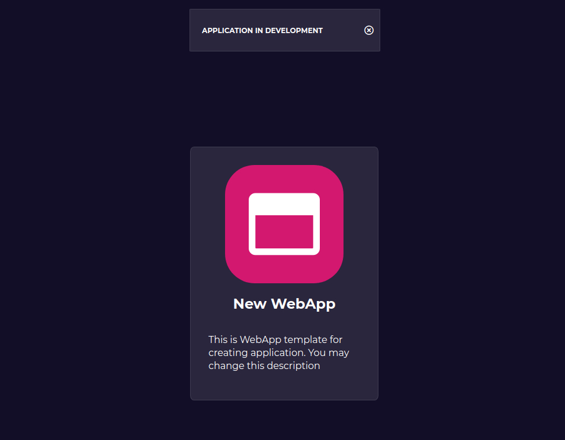

# luckyboard-webapptemplate
WebApp Template for Luckyboard.Studio

### Screenshot

### WebApp by LuckyBoard is:
* jQuery/JavaScript/PHP/Sass Stack
* Used BEM Methodology by Yandex
* Logical structure helps you to make it easy!

## Thank You!
Please ⭐️ this repo and share it with others

### Contributing 💡
If you want to contribute to this project and make it better with new ideas, your pull request is very welcomed.
If you find any issue just put it in the repository issue section, thank you.
